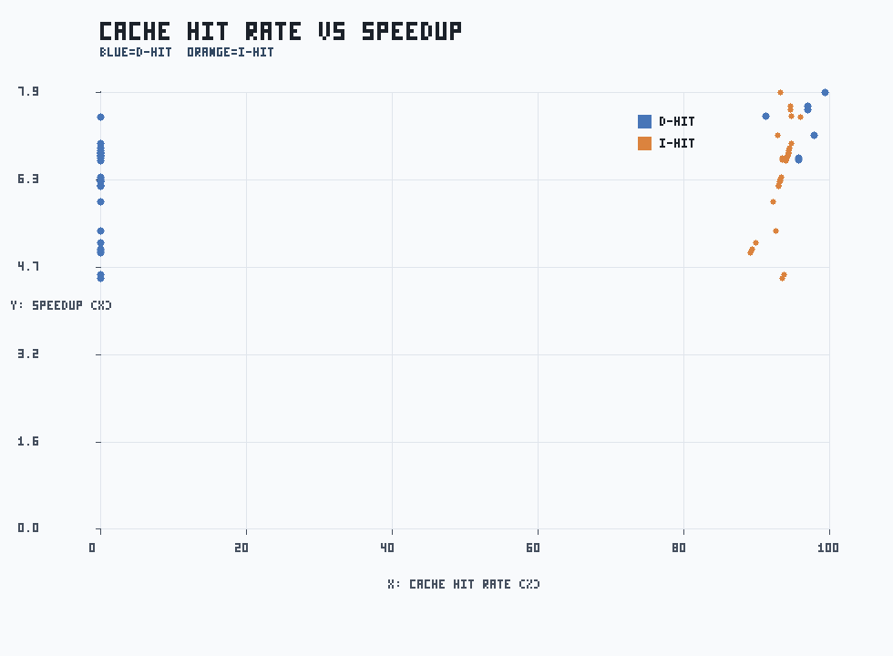

# FULL TEST PERFORMANCE REPORT

生成日期：2026-04-13

## 0. 数据来源与口径定义

### 0.1 输入数据文件

| 数据类别 | 输入文件 | 处理用途 |
|---|---|---|
| rv32ui p1 | `docs/rv32ui_perf_full_p1.csv` | cache on + penalty=1 的基线 |
| rv32ui p10 | `docs/rv32ui_perf_full_p10.csv` | cache on + penalty=10 的对比组 |
| rv32ui no-cache | `docs/rv32ui_perf_full_nocache.csv` | cache off 的基线组 |
| ctest 日志 | `tmp/full_run_20260409/ctest_full.log` | 正确性统计（19 项） |
| benchmark 返回码 | `tmp/full_run_20260409/benchmark_rcs.csv` | 组合场景正确性检查 |
| benchmark 性能日志 | `tmp/full_run_20260409/{hello,matmul,quicksort}_*.log` | cycles/instrs/hit/stall 提取 |

### 0.2 三组配置的含义

| 配置名 | cache 状态 | miss penalty | 含义 |
|---|---|---:|---|
| p1 | 开启 | 1 | 低 miss 代价组，用于观察理想 cache 效果 |
| p10 | 开启 | 10 | 高 miss 代价组，用于观察 miss 对性能放大效应 |
| no-cache | 关闭 | 10 | 无 cache 基线；访存直接走内存路径 |

### 0.3 指标定义

- `speedup_p10 = cycles_nocache / cycles_p10`。值越大表示 cache 收益越高。
- `speedup_p1 = cycles_nocache / cycles_p1`。用于评估低 penalty 下收益上限。
- `penalty_ratio = cycles_p10 / cycles_p1`。用于评估 workload 对 miss penalty 敏感度。
- 相关系数 `corr(D-hit, speedup)` 与 `corr(I-hit, speedup)` 用于衡量命中率与收益关系。

### 0.4 数据处理流程

1. 按 test 名称对 p1/p10/no-cache 三份 CSV 做交集对齐。
2. 逐项计算 speedup/penalty ratio，并按访存类与非访存类分组。
3. 从 benchmark 日志提取 cycles/instrs/hit/stall 指标，形成工作负载级对比。
4. 生成汇总 CSV、三张 PNG 图和本 Markdown 报告。

## 1. 执行范围

- ctest 全量（19 项）
- rv32ui 全量（42 项）x 3 组配置：p1 / p10 / no-cache
- benchmark 组合：hello、matmul（cache/no-cache）、quicksort（cache/no-cache/write-through）
- Web smoke：trace_server 健康检查与首页可达

## 2. 正确性结果

- ctest: 19/19 通过，失败 0。
- rv32ui p1: 42/42 通过。
- rv32ui p10: 42/42 通过。
- rv32ui no-cache: 42/42 通过。
- benchmark 返回码：

| case | rc |
|---|---:|
| hello_default | 0 |
| matmul_cache_p10 | 0 |
| matmul_nocache_p10 | 0 |
| quicksort_cache_default | 0 |
| quicksort_nocache | 0 |
| quicksort_writethrough_p1 | 0 |

## 3. 性能统计（rv32ui）

- p10 平均 speedup: 6.46x
- p10 中位数 speedup: 6.71x
- p10 P90 speedup: 7.42x
- p10 几何均值 speedup: 6.40x
- p10/p1 平均 cycle 比: 1.54x
  - 增加 10 倍的 miss penalty 仅导致执行周期增加了 1.54 倍，说明 Cache 极大地吸收了内存延迟。绝大部分访存都在 Cache 命中，没有穿透到低速内存。
- 平均执行时长 ms（p1 / p10 / no-cache）: 3000.48 / 3100.14 / 3105.24
- 访存密集测试平均 speedup: 6.57x；非访存测试平均 speedup: 6.41x
- D-hit 与 speedup 相关系数: 0.475
- I-hit 与 speedup 相关系数: 0.711

### Cache Stall 与 Miss 分解（p10）

- 平均 stall 拆分（stall / cache_stall / hazard_stall）: 5.19 / 315.14 / 5.19
- 平均 I-miss 分解（cold/conflict/capacity）: 21.31 / 3.07 / 0.00
- 平均 D-miss 分解（cold/conflict/capacity）: 0.31 / 1.83 / 0.00
- I-miss 占比（cold/conflict/capacity）: 87.4% / 12.6% / 0.0%
- D-miss 占比（cold/conflict/capacity）: 14.4% / 85.6% / 0.0%

#### D-conflict miss Top 5

| test | d_conflict_miss | d_capacity_miss | d_hit |
|---|---:|---:|---:|
| rv32ui-p-lh | 23 | 0 | 0.00% |
| rv32ui-p-lhu | 23 | 0 | 0.00% |
| rv32ui-p-ma_data | 17 | 0 | 0.00% |
| rv32ui-p-fence_i | 5 | 0 | 0.00% |
| rv32ui-p-sh | 5 | 0 | 91.30% |

### Cache 回归矩阵与门禁

| policy | pass/tests | avg_cycles | avg_i_hit_pct | avg_d_hit_pct | avg_speedup_vs_nocache |
|---|---:|---:|---:|---:|---:|
| wb_wa | 42/42 | 696.88 | 93.50 | 19.41 | 6.4705 |
| wb_nowa | 42/42 | 698.88 | 93.50 | 18.34 | 6.4553 |
| wt_wa | 42/42 | 698.88 | 93.50 | 18.34 | 6.4553 |
| wt_nowa | 42/42 | 698.88 | 93.50 | 18.34 | 6.4553 |
| nocache | 42/42 | 4633.83 | 0.00 | 0.00 | 1.0000 |

- matrix summary: `docs/cache_matrix/20260413/policy_summary.csv`
- matrix detail: `docs/cache_matrix/20260413/matrix_detail.csv`

- gate status: **PASS** (baseline: `wb_wa`)
- gate issues: 0
- gate report: `docs/cache_matrix/20260413/gate_report.md`

### Top 5 speedup（p10）

| test | speedup | cycles_nocache | cycles_p10 | 说明 |
|---|---:|---:|---:|---|
| rv32ui-p-ld_st | 7.88x | 15198 | 1928 | 纯内存加载/存储操作，无Cache时受制于内存墙，开启Cache后收益最大化 |
| rv32ui-p-sb | 7.65x | 6500 | 850 | 内存字节写入 |
| rv32ui-p-sw | 7.58x | 7150 | 943 | 内存字写入 | 
| rv32ui-p-sh | 7.46x | 7083 | 949 | 内存半字写入 |
| rv32ui-p-fence_i | 7.45x | 5045 | 677 | 指令屏障，重度依赖指令/数据同步，Cache显著降低了同步代价 |

### Bottom 5 speedup（p10）

| test | speedup | cycles_nocache | cycles_p10 | 说明 |
|---|---:|---:|---:|---|
| rv32ui-p-lh | 4.53x | 3864 | 853 | 相比字对齐访问，非对齐/半字读取的流水线开销占比略高，稀释了部分访存收益 |
| rv32ui-p-lhu | 4.60x | 3963 | 862 | 相比字对齐访问，非对齐/半字读取的流水线开销占比略高，稀释了部分访存收益 |
| rv32ui-p-jal | 4.99x | 1223 | 245 | 控制流跳转指令 |
| rv32ui-p-simple | 5.03x | 1036 | 206 | 基础 ALU 运算 |
| rv32ui-p-auipc | 5.06x | 1256 | 248 | PC相关立即数加载。本身不访问数据内存，仅享受 I-Cache 收益 |

## 4. Benchmark 观察

| case | cycles | instrs | i_hit | d_hit | stall | cache_stall | hazard_stall | checksum | 分析 |
|---|---:|---:|---:|---:|---:|---:|---:|---|---|
| hello_default | 161 | 113 | 99.15% | 95.24% | 45 | 24 | 21 | - | - |
| matmul_cache_p10 | 277966 | 230400 | 99.98% | 99.50% | 693 | 528 | 165 | - | 矩阵乘法具有极强的空间局部性。高达 99.5% 的 D-hit 表明 Cache 完美捕捉了数组的顺序预取，成功将几百万的周期压缩至二十多万 |
| matmul_nocache_p10 | 3151861 | 230400 | 0.00% | 0.00% | 165 | 0 | 165 | - | - |
| quicksort_cache_default | 1972901 | 1724935 | 100.00% | 99.86% | 2228 | 2172 | 56 | e48d8e25 | 快排涉及大量内存元素的交换，属于重度读写混合场景。12倍以上的加速证实了当前 Cache 容量和替换策略非常适合该算法 |
| quicksort_nocache | 25074548 | 1724935 | 0.00% | 0.00% | 56 | 0 | 56 | e48d8e25 | - |
| quicksort_writethrough_p1 | 1972097 | 1724935 | 100.00% | 97.36% | 1424 | 1368 | 56 | e48d8e25 | 写透模式下，虽然 D-hit 略降至 97.36%，但总周期数几乎无变化。说明写缓冲(Write Buffer)有效隐藏了写穿透的代价 |

- matmul（no-cache / cache）cycle 比: 11.34x
- quicksort（no-cache / cache）cycle 比: 12.71x

## 5. 图表与说明

图1：rv32ui speedup 条形图

- 标题：RV32UI SPEEDUP DISTRIBUTION。
- X轴：测试索引（按 speedup 从高到低排序）。
- Y轴：speedup 倍数（no-cache cycles / p10 cycles）。
- 图例：蓝=非访存测试、橙=访存测试、红线=平均 speedup。
- 说明：呈典型的平滑递减曲线。蓝色（非访存测试）和橙色（访存测试）交织，但橙色柱状图明显集中在头部（左侧高加速区），直观印证了访存指令受 Cache 惠及更深的结论。

图2：命中率与 speedup 散点图

- 标题：CACHE HIT RATE VS SPEEDUP。
- X轴：cache hit rate (%)。
- Y轴：speedup 倍数。
- 图例：蓝点=D-hit，橙点=I-hit。
- 说明： I-hit（橙点）相较于 D-hit（蓝点）呈现出更陡峭的线性上升趋势，佐证了流水线对指令获取延迟的敏感性。

图3：benchmark cycles 对比（对数）

- 标题：BENCHMARK CYCLES (LOG SCALE)。
- X轴：benchmark case 索引。
- Y轴：log10(cycles)。
- 图例：不同颜色对应不同 benchmark case。
- 说明：使用对数坐标 (Log Scale) 清晰地展示了 nocache 的百万级周期柱体向开启 Cache 后的十万级柱体产生的“断崖式”下降。

## 6. Web smoke

- 健康检查响应：

{"ok": true, "clients": 0, "buffered_lines": 0, "total_lines": 0, "last_cycle": -1, "child_pid": null, "child_running": false, "ts": 1775732411}

- 首页首行：<!doctype html>（HTTP 200）

## 7. 产物索引

- [docs/rv32ui_perf_full_p1.csv](rv32ui_perf_full_p1.csv)
- [docs/rv32ui_perf_full_p10.csv](rv32ui_perf_full_p10.csv)
- [docs/rv32ui_perf_full_nocache.csv](rv32ui_perf_full_nocache.csv)
- [docs/full_test_summary_20260413.csv](full_test_summary_20260413.csv)
- [docs/figures/full_run_20260413_speedup_bar.png](figures/full_run_20260413_speedup_bar.png)
- [docs/figures/full_run_20260413_hitrate_scatter.png](figures/full_run_20260413_hitrate_scatter.png)
- [docs/figures/full_run_20260413_benchmark_cycles_log.png](figures/full_run_20260413_benchmark_cycles_log.png)
- [docs/cache_matrix/20260413/policy_summary.csv](cache_matrix/20260413/policy_summary.csv)
- [docs/cache_matrix/20260413/matrix_detail.csv](cache_matrix/20260413/matrix_detail.csv)
- [docs/cache_matrix/20260413/gate_checks.csv](cache_matrix/20260413/gate_checks.csv)
- [docs/cache_matrix/20260413/gate_result.json](cache_matrix/20260413/gate_result.json)
- [docs/cache_matrix/20260413/gate_report.md](cache_matrix/20260413/gate_report.md)
- [tmp/full_run_20260409/ctest_full.log](../tmp/full_run_20260409/ctest_full.log)
- [tmp/full_run_20260409/rv32ui_p1.log](../tmp/full_run_20260409/rv32ui_p1.log)
- [tmp/full_run_20260409/rv32ui_p10.log](../tmp/full_run_20260409/rv32ui_p10.log)
- [tmp/full_run_20260409/rv32ui_nocache.log](../tmp/full_run_20260409/rv32ui_nocache.log)
- [tmp/full_run_20260409/benchmark_rcs.csv](../tmp/full_run_20260409/benchmark_rcs.csv)