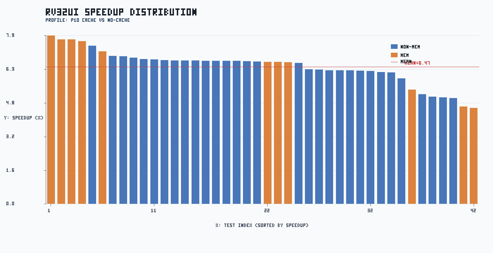
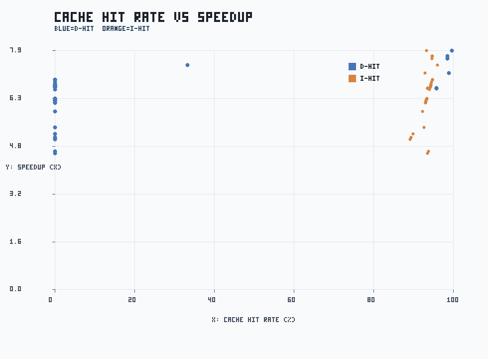
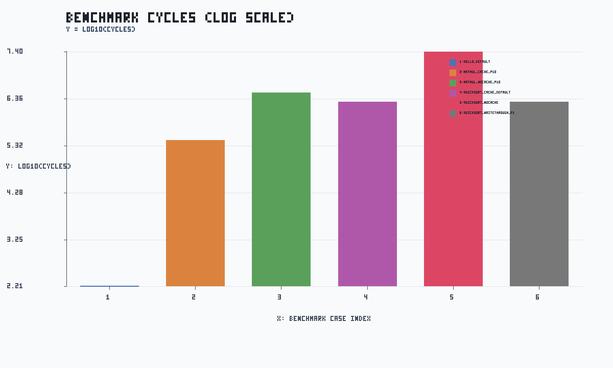

# FULL TEST PERFORMANCE REPORT

生成日期：2026-04-09

## 0. 数据来源与口径定义

### 0.1 输入数据文件

| 数据类别 | 输入文件 | 处理用途 |
|---|---|---|
| rv32ui p1 | `docs/rv32ui_perf_full_p1.csv` | cache on + penalty=1 的基线 |
| rv32ui p10 | `docs/rv32ui_perf_full_p10.csv` | cache on + penalty=10 的对比组 |
| rv32ui no-cache | `docs/rv32ui_perf_full_nocache.csv` | cache off 的基线组 |
| ctest 日志 | `tmp/full_run_20260409/ctest_full.log` | 正确性统计（19 项） |
| benchmark 返回码 | `tmp/full_run_20260409/benchmark_rcs.csv` | 组合场景正确性检查 |
| benchmark 性能日志 | `tmp/full_run_20260409/{hello,matmul,quicksort}_*.log` | cycles/instrs/hit/stall 提取 |

### 0.2 三组配置的含义

| 配置名 | cache 状态 | miss penalty | 含义 |
|---|---|---:|---|
| p1 | 开启 | 1 | 低 miss 代价组，用于观察理想 cache 效果 |
| p10 | 开启 | 10 | 高 miss 代价组，用于观察 miss 对性能放大效应 |
| no-cache | 关闭 | 10 | 无 cache 基线；访存直接走内存路径 |

### 0.3 指标定义

- `speedup_p10 = cycles_nocache / cycles_p10`。值越大表示 cache 收益越高。
- `speedup_p1 = cycles_nocache / cycles_p1`。用于评估低 penalty 下收益上限。
- `penalty_ratio = cycles_p10 / cycles_p1`。用于评估 workload 对 miss penalty 敏感度。
- 相关系数 `corr(D-hit, speedup)` 与 `corr(I-hit, speedup)` 用于衡量命中率与收益关系。

### 0.4 数据处理流程

1. 按 test 名称对 p1/p10/no-cache 三份 CSV 做交集对齐。
2. 逐项计算 speedup/penalty ratio，并按访存类与非访存类分组。
3. 从 benchmark 日志提取 cycles/instrs/hit/stall 指标，形成工作负载级对比。
4. 生成汇总 CSV、三张 PNG 图和本 Markdown 报告。

## 1. 执行范围

- ctest 全量（19 项）
- rv32ui 全量（42 项）x 3 组配置：p1 / p10 / no-cache
- benchmark 组合：hello、matmul（cache/no-cache）、quicksort（cache/no-cache/write-through）
- Web smoke：trace_server 健康检查与首页可达

## 2. 正确性结果

- ctest: 19/19 通过，失败 0。
- rv32ui p1: 42/42 通过。
- rv32ui p10: 42/42 通过。
- rv32ui no-cache: 42/42 通过。
- benchmark 返回码：

| case | rc |
|---|---:|
| hello_default | 0 |
| matmul_cache_p10 | 0 |
| matmul_nocache_p10 | 0 |
| quicksort_cache_default | 0 |
| quicksort_nocache | 0 |
| quicksort_writethrough_p1 | 0 |

## 3. 性能统计（rv32ui）

- p10 平均 speedup: 6.47x
- p10 中位数 speedup: 6.71x
- p10 P90 speedup: 7.43x
- p10 几何均值 speedup: 6.42x
- p10/p1 平均 cycle 比: 1.54x
- 平均执行时长 ms（p1 / p10 / no-cache）: 3240.55 / 2848.19 / 2902.29
- 访存密集测试平均 speedup: 6.63x；非访存测试平均 speedup: 6.41x
- D-hit 与 speedup 相关系数: 0.530
- I-hit 与 speedup 相关系数: 0.703

### Top 5 speedup（p10）

| test | speedup | cycles_nocache | cycles_p10 |
|---|---:|---:|---:|
| rv32ui-p-ld_st | 7.93x | 15198 | 1916 |
| rv32ui-p-sh | 7.76x | 7083 | 913 |
| rv32ui-p-sb | 7.76x | 6500 | 838 |
| rv32ui-p-sw | 7.68x | 7150 | 931 |
| rv32ui-p-fence_i | 7.45x | 5045 | 677 |

### Bottom 5 speedup（p10）

| test | speedup | cycles_nocache | cycles_p10 |
|---|---:|---:|---:|
| rv32ui-p-lh | 4.53x | 3864 | 853 |
| rv32ui-p-lhu | 4.60x | 3963 | 862 |
| rv32ui-p-jal | 4.99x | 1223 | 245 |
| rv32ui-p-simple | 5.03x | 1036 | 206 |
| rv32ui-p-auipc | 5.06x | 1256 | 248 |

## 4. Benchmark 观察

| case | cycles | instrs | i_hit | d_hit | stall | cache_stall | hazard_stall | checksum |
|---|---:|---:|---:|---:|---:|---:|---:|---|
| hello_default | 161 | 113 | 99.15% | 95.24% | 45 | 24 | 21 | - |
| matmul_cache_p10 | 277966 | 230400 | 99.98% | 99.50% | 693 | 528 | 165 | - |
| matmul_nocache_p10 | 3151861 | 230400 | 0.00% | 0.00% | 165 | 0 | 165 | - |
| quicksort_cache_default | 1972901 | 1724935 | 100.00% | 99.86% | 2228 | 2172 | 56 | e48d8e25 |
| quicksort_nocache | 25074548 | 1724935 | 0.00% | 0.00% | 56 | 0 | 56 | e48d8e25 |
| quicksort_writethrough_p1 | 1972097 | 1724935 | 100.00% | 97.36% | 1424 | 1368 | 56 | e48d8e25 |

- matmul（no-cache / cache）cycle 比: 11.34x
- quicksort（no-cache / cache）cycle 比: 12.71x

## 5. 图表与说明

图1：rv32ui speedup 条形图

- 标题：RV32UI SPEEDUP DISTRIBUTION。
- X轴：测试索引（按 speedup 从高到低排序）。
- Y轴：speedup 倍数（no-cache cycles / p10 cycles）。
- 图例：蓝=非访存测试、橙=访存测试、红线=平均 speedup。
- 说明：该图用于识别 cache 收益分布和尾部低收益用例。

图2：命中率与 speedup 散点图

- 标题：CACHE HIT RATE VS SPEEDUP。
- X轴：cache hit rate (%)。
- Y轴：speedup 倍数。
- 图例：蓝点=D-hit，橙点=I-hit。
- 说明：用于观察命中率提升与性能收益的相关关系。

图3：benchmark cycles 对比（对数）

- 标题：BENCHMARK CYCLES (LOG SCALE)。
- X轴：benchmark case 索引。
- Y轴：log10(cycles)。
- 图例：不同颜色对应不同 benchmark case。
- 说明：对数坐标可在同图中比较百万级与百级 workload。

## 6. Web smoke

- 健康检查响应：

{"ok": true, "clients": 0, "buffered_lines": 0, "total_lines": 0, "last_cycle": -1, "child_pid": null, "child_running": false, "ts": 1775732411}

- 首页首行：<!doctype html>（HTTP 200）

## 7. 产物索引

- [docs/rv32ui_perf_full_p1.csv](rv32ui_perf_full_p1.csv)
- [docs/rv32ui_perf_full_p10.csv](rv32ui_perf_full_p10.csv)
- [docs/rv32ui_perf_full_nocache.csv](rv32ui_perf_full_nocache.csv)
- [docs/full_test_summary_20260409.csv](full_test_summary_20260409.csv)
- [docs/figures/full_run_20260409_speedup_bar.png](figures/full_run_20260409_speedup_bar.png)
- [docs/figures/full_run_20260409_hitrate_scatter.png](figures/full_run_20260409_hitrate_scatter.png)
- [docs/figures/full_run_20260409_benchmark_cycles_log.png](figures/full_run_20260409_benchmark_cycles_log.png)
- [tmp/full_run_20260409/ctest_full.log](../tmp/full_run_20260409/ctest_full.log)
- [tmp/full_run_20260409/rv32ui_p1.log](../tmp/full_run_20260409/rv32ui_p1.log)
- [tmp/full_run_20260409/rv32ui_p10.log](../tmp/full_run_20260409/rv32ui_p10.log)
- [tmp/full_run_20260409/rv32ui_nocache.log](../tmp/full_run_20260409/rv32ui_nocache.log)
- [tmp/full_run_20260409/benchmark_rcs.csv](../tmp/full_run_20260409/benchmark_rcs.csv)
