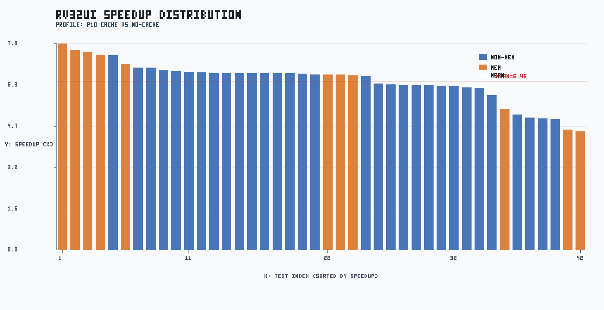
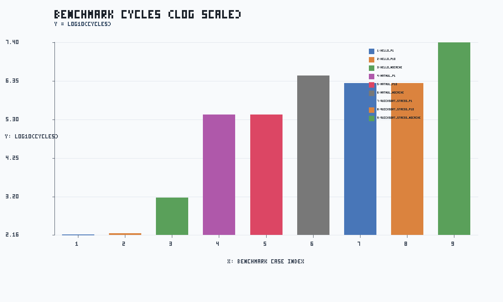

# FULL TEST PERFORMANCE REPORT

生成日期：2026-04-14

## 0. 数据来源与口径定义

### 0.1 输入数据文件

| 数据类别 | 输入文件 | 处理用途 |
|---|---|---|
| rv32ui p1 | `docs/rv32ui_perf_full_p1.csv` | cache on + penalty=1 的基线 |
| rv32ui p10 | `docs/rv32ui_perf_full_p10.csv` | cache on + penalty=10 的对比组 |
| rv32ui no-cache | `docs/rv32ui_perf_full_nocache.csv` | cache off 的基线组 |
| ctest 日志 | `tmp/full_run_20260413/ctest_full.log` | 正确性统计（ctest 全量） |
| benchmark 汇总 | `docs/benchmark/20260414/benchmark_summary.csv` | benchmark 三配置（p1/p10/no-cache）汇总统计 |
| benchmark 明细 | `docs/benchmark/20260414/benchmark_detail.csv` | benchmark profile 级明细（用于图表） |
| benchmark 原始 CSV | `docs/benchmark/20260414/benchmark_p1.csv` / `docs/benchmark/20260414/benchmark_p10.csv` / `docs/benchmark/20260414/benchmark_nocache.csv` | 每个 profile 的原始输出 |
| benchmark cache matrix 汇总 | `docs/cache_matrix/20260413/benchmark_policy_summary.csv` | benchmark 在 5 策略下的汇总统计 |
| benchmark cache matrix 明细 | `docs/cache_matrix/20260413/benchmark_matrix_detail.csv` | benchmark x cache 策略明细 |

### 0.2 三组配置的含义

| 配置名 | cache 状态 | miss penalty | 含义 |
|---|---|---:|---|
| p1 | 开启 | 1 | 低 miss 代价组，用于观察理想 cache 效果 |
| p10 | 开启 | 10 | 高 miss 代价组，用于观察 miss 对性能放大效应 |
| no-cache | 关闭 | 10 | 无 cache 基线；访存直接走内存路径 |

### 0.3 指标定义

- `speedup_p10 = cycles_nocache / cycles_p10`。值越大表示 cache 收益越高。
- `speedup_p1 = cycles_nocache / cycles_p1`。用于评估低 penalty 下收益上限。
- `penalty_ratio = cycles_p10 / cycles_p1`。用于评估 workload 对 miss penalty 敏感度。
- 相关系数 `corr(D-hit, speedup)` 与 `corr(I-hit, speedup)` 用于衡量命中率与收益关系。

### 0.4 数据处理流程

1. 按 test 名称对 p1/p10/no-cache 三份 CSV 做交集对齐。
2. 逐项计算 speedup/penalty ratio，并按访存类与非访存类分组。
3. 从 benchmark_summary/detail.csv 读取 cycles/hit/stall 与 speedup 指标，形成工作负载级对比。
4. 从 benchmark_policy_summary.csv 读取 cache 策略矩阵，做跨策略回归分析。
5. 生成汇总 CSV、三张 PNG 图和本 Markdown 报告。

## 1. 执行范围

- ctest 全量（20 项）
- rv32ui 全量（42 项）x 3 组配置：p1 / p10 / no-cache
- benchmark 组合：hello、matmul（cache/no-cache）、quicksort（cache/no-cache/write-through）
- benchmark cache matrix：wb_wa / wb_nowa / wt_wa / wt_nowa / nocache
- Web smoke：trace_server 健康检查与首页可达

## 2. 正确性结果

- ctest: 20/20 通过，失败 0。
- rv32ui p1: 42/42 通过。
- rv32ui p10: 42/42 通过。
- rv32ui no-cache: 42/42 通过。
- benchmark 返回码：

| benchmark | rc_p1 | rc_p10 | rc_nocache |
|---|---:|---:|---:|
| hello | 0 | 0 | 0 |
| matmul | 0 | 0 | 0 |
| quicksort_stress | 0 | 0 | 0 |

## 3. 性能统计（rv32ui）

- p10 平均 speedup: 6.46x
- p10 中位数 speedup: 6.71x
- p10 P90 speedup: 7.42x
- p10 几何均值 speedup: 6.40x
- p10/p1 平均 cycle 比: 1.54x
- 平均执行时长 ms（p1 / p10 / no-cache）: 3000.48 / 3100.14 / 3105.24
- 访存密集测试平均 speedup: 6.57x；非访存测试平均 speedup: 6.41x
- D-hit 与 speedup 相关系数: 0.475
- I-hit 与 speedup 相关系数: 0.711

### Cache Stall 与 Miss 分解（p10）

- 平均 stall 拆分（stall / cache_stall / hazard_stall）: 5.19 / 315.14 / 5.19
- 平均 I-miss 分解（cold/conflict/capacity）: 21.31 / 3.07 / 0.00
- 平均 D-miss 分解（cold/conflict/capacity）: 0.31 / 1.83 / 0.00
- I-miss 占比（cold/conflict/capacity）: 87.4% / 12.6% / 0.0%
- D-miss 占比（cold/conflict/capacity）: 14.4% / 85.6% / 0.0%

#### D-conflict miss Top 5

| test | d_conflict_miss | d_capacity_miss | d_hit |
|---|---:|---:|---:|
| rv32ui-p-lh | 23 | 0 | 0.00% |
| rv32ui-p-lhu | 23 | 0 | 0.00% |
| rv32ui-p-ma_data | 17 | 0 | 0.00% |
| rv32ui-p-fence_i | 5 | 0 | 0.00% |
| rv32ui-p-sh | 5 | 0 | 91.30% |

### Cache 回归矩阵与门禁

| policy | pass/tests | avg_cycles | avg_i_hit_pct | avg_d_hit_pct | avg_speedup_vs_nocache |
|---|---:|---:|---:|---:|---:|
| wb_wa | 42/42 | 696.88 | 93.50 | 19.41 | 6.4705 |
| wb_nowa | 42/42 | 698.88 | 93.50 | 18.34 | 6.4553 |
| wt_wa | 42/42 | 698.88 | 93.50 | 18.34 | 6.4553 |
| wt_nowa | 42/42 | 698.88 | 93.50 | 18.34 | 6.4553 |
| nocache | 42/42 | 4633.83 | 0.00 | 0.00 | 1.0000 |

- matrix summary: `docs/cache_matrix/20260413/policy_summary.csv`
- matrix detail: `docs/cache_matrix/20260413/matrix_detail.csv`

- gate status: **PASS** (baseline: `wb_wa`)
- gate issues: 0
- gate report: `docs/cache_matrix/20260413/gate_report.md`

### Benchmark Cache Matrix 与门禁

| policy | pass/benchmarks | avg_cycles | avg_i_hit_pct | avg_d_hit_pct | avg_speedup_vs_nocache |
|---|---:|---:|---:|---:|---:|
| wb_wa | 3/3 | 750342.67 | 99.71 | 98.20 | 11.1590 |
| wb_nowa | 3/3 | 751638.67 | 99.71 | 93.95 | 11.1440 |
| wt_wa | 3/3 | 751638.67 | 99.71 | 93.95 | 11.1440 |
| wt_nowa | 3/3 | 751638.67 | 99.71 | 93.95 | 11.1440 |
| nocache | 3/3 | 9409309.00 | 0.00 | 0.00 | 1.0000 |

- benchmark matrix summary: `docs/cache_matrix/20260413/benchmark_policy_summary.csv`
- benchmark matrix detail: `docs/cache_matrix/20260413/benchmark_matrix_detail.csv`
- benchmark cache gate status: **PASS**
- benchmark cache gate issues: 0
- benchmark cache gate report: `docs/cache_matrix/20260413/benchmark_cache_gate_report.md`

### Top 5 speedup（p10）

| test | speedup | cycles_nocache | cycles_p10 |
|---|---:|---:|---:|
| rv32ui-p-ld_st | 7.88x | 15198 | 1928 |
| rv32ui-p-sb | 7.65x | 6500 | 850 |
| rv32ui-p-sw | 7.58x | 7150 | 943 |
| rv32ui-p-sh | 7.46x | 7083 | 949 |
| rv32ui-p-fence_i | 7.45x | 5045 | 677 |

### Bottom 5 speedup（p10）

| test | speedup | cycles_nocache | cycles_p10 |
|---|---:|---:|---:|
| rv32ui-p-lh | 4.53x | 3864 | 853 |
| rv32ui-p-lhu | 4.60x | 3963 | 862 |
| rv32ui-p-jal | 4.99x | 1223 | 245 |
| rv32ui-p-simple | 5.03x | 1036 | 206 |
| rv32ui-p-auipc | 5.06x | 1256 | 248 |

## 4. Benchmark 观察

| benchmark | cycles_p1 | cycles_p10 | cycles_nocache | speedup_p10 | speedup_p1 | penalty_ratio | i_hit_p10 | d_hit_p10 | stall_p10 | checksum_p10 |
|---|---:|---:|---:|---:|---:|---:|---:|---:|---:|---|
| hello | 143 | 161 | 1518 | 9.43x | 10.62x | 1.13x | 99.15% | 95.24% | 21 | - |
| matmul | 277570 | 277966 | 3151861 | 11.34x | 11.36x | 1.00x | 99.98% | 99.50% | 165 | - |
| quicksort_stress | 1971272 | 1972901 | 25074548 | 12.71x | 12.72x | 1.00x | 100.00% | 99.86% | 56 | e48d8e25 |

- benchmark 平均 speedup_p10: 11.16x；中位数: 11.34x。
- benchmark 平均 penalty_ratio_p10_over_p1: 1.04x。
- matmul（no-cache / p10）cycle 比: 11.34x
- quicksort_stress（no-cache / p10）cycle 比: 12.71x
- benchmark gate status: **PASS**
- benchmark gate issues: 0
- benchmark summary: `docs/benchmark/20260414/benchmark_summary.csv`
- benchmark detail: `docs/benchmark/20260414/benchmark_detail.csv`
- benchmark gate report: `docs/benchmark/20260414/benchmark_gate_report.md`

## 5. 图表与说明

图1：rv32ui speedup 条形图

- 标题：RV32UI SPEEDUP DISTRIBUTION。
- X轴：测试索引（按 speedup 从高到低排序）。
- Y轴：speedup 倍数（no-cache cycles / p10 cycles）。
- 图例：蓝=非访存测试、橙=访存测试、红线=平均 speedup。
- 说明：该图用于识别 cache 收益分布和尾部低收益用例。

图2：命中率与 speedup 散点图

- 标题：CACHE HIT RATE VS SPEEDUP。
- X轴：cache hit rate (%)。
- Y轴：speedup 倍数。
- 图例：蓝点=D-hit，橙点=I-hit。
- 说明：用于观察命中率提升与性能收益的相关关系。

图3：benchmark cycles 对比（对数）

- 标题：BENCHMARK CYCLES (LOG SCALE)。
- X轴：benchmark case 索引。
- Y轴：log10(cycles)。
- 图例：不同颜色对应不同 benchmark case。
- 说明：对数坐标可在同图中比较百万级与百级 workload。

## 6. Web smoke

- 采样状态：**PASS**
- 状态说明：sampled
- 健康检查响应：

{"ok": true, "clients": 0, "buffered_lines": 0, "total_lines": 0, "last_cycle": -1, "child_pid": null, "child_running": false, "ts": 1776134762}

- 首页首行：<!doctype html>
- web_health 文件：`tmp/full_run_20260413/web_health.json`
- web_index_head 文件：`tmp/full_run_20260413/web_index_head.txt`
- web_smoke_status 文件：`tmp/full_run_20260413/web_smoke_status.json`

## 7. 磁盘占用（清理前）

### 核心目录占用

- 7.7M	build
- 36K	tmp
- 240K	docs

### 根目录 Top10

- 7.7M	./build
- 4.2M	./riscv-tests
- 240K	./docs
- 208K	./archive
- 204K	./src
- 176K	./tools
- 96K	./tests
- 64K	./web
- 52K	./benchmarks
- 36K	./tmp

## 8. 产物索引

- [docs/rv32ui_perf_full_p1.csv](rv32ui_perf_full_p1.csv)
- [docs/rv32ui_perf_full_p10.csv](rv32ui_perf_full_p10.csv)
- [docs/rv32ui_perf_full_nocache.csv](rv32ui_perf_full_nocache.csv)
- [docs/full_test_summary_20260414.csv](full_test_summary_20260414.csv)
- [docs/figures/full_run_20260414_speedup_bar.png](figures/full_run_20260414_speedup_bar.png)
- [docs/figures/full_run_20260414_hitrate_scatter.png](figures/full_run_20260414_hitrate_scatter.png)
- [docs/figures/full_run_20260414_benchmark_cycles_log.png](figures/full_run_20260414_benchmark_cycles_log.png)
- [docs/cache_matrix/20260413/policy_summary.csv](cache_matrix/20260413/policy_summary.csv)
- [docs/cache_matrix/20260413/matrix_detail.csv](cache_matrix/20260413/matrix_detail.csv)
- [docs/cache_matrix/20260413/benchmark_policy_summary.csv](cache_matrix/20260413/benchmark_policy_summary.csv)
- [docs/cache_matrix/20260413/benchmark_matrix_detail.csv](cache_matrix/20260413/benchmark_matrix_detail.csv)
- [docs/cache_matrix/20260413/gate_checks.csv](cache_matrix/20260413/gate_checks.csv)
- [docs/cache_matrix/20260413/gate_result.json](cache_matrix/20260413/gate_result.json)
- [docs/cache_matrix/20260413/gate_report.md](cache_matrix/20260413/gate_report.md)
- [docs/cache_matrix/20260413/benchmark_cache_gate_checks.csv](cache_matrix/20260413/benchmark_cache_gate_checks.csv)
- [docs/cache_matrix/20260413/benchmark_cache_gate_result.json](cache_matrix/20260413/benchmark_cache_gate_result.json)
- [docs/cache_matrix/20260413/benchmark_cache_gate_report.md](cache_matrix/20260413/benchmark_cache_gate_report.md)
- [docs/benchmark/20260414/benchmark_p1.csv](benchmark/20260414/benchmark_p1.csv)
- [docs/benchmark/20260414/benchmark_p10.csv](benchmark/20260414/benchmark_p10.csv)
- [docs/benchmark/20260414/benchmark_nocache.csv](benchmark/20260414/benchmark_nocache.csv)
- [docs/benchmark/20260414/benchmark_detail.csv](benchmark/20260414/benchmark_detail.csv)
- [docs/benchmark/20260414/benchmark_summary.csv](benchmark/20260414/benchmark_summary.csv)
- [docs/benchmark/20260414/benchmark_gate_checks.csv](benchmark/20260414/benchmark_gate_checks.csv)
- [docs/benchmark/20260414/benchmark_gate_result.json](benchmark/20260414/benchmark_gate_result.json)
- [docs/benchmark/20260414/benchmark_gate_report.md](benchmark/20260414/benchmark_gate_report.md)
- [tmp/full_run_20260413/web_health.json](../tmp/full_run_20260413/web_health.json)
- [tmp/full_run_20260413/web_index_head.txt](../tmp/full_run_20260413/web_index_head.txt)
- [tmp/full_run_20260413/web_smoke_status.json](../tmp/full_run_20260413/web_smoke_status.json)
- [tmp/full_run_20260413/ctest_full.log](../tmp/full_run_20260413/ctest_full.log)

## 9. 文件整理与清理建议

### 9.1 建议归档（阶段性成果）

- 建议目录：`archive/`（按 `stage-*` 分组，必要时在目录名加日期前缀）。
- 建议归档：`tmp/*.log`、`tmp/fail_debug/*.out`、阶段性脚本与旧对比产物。
- 建议归档说明文件包含：阶段目标、来源命令、时间、输入输出文件、复现方式。

### 9.2 可立即删除（可重建）

- `build/`（当前约 7.7M）：CMake 构建产物，可重新编译恢复。
- `Testing/`（当前约 -）：CTest 运行缓存。
- `tmp/full_run_20260413`（属于 `tmp/` 的一部分，当前约 36K）：本轮原始日志目录。

### 9.3 不建议删除

- `src/`、`tests/`、`CMakeLists.txt`、`test_all.sh`：核心代码与测试入口。
- `riscv-tests/`：官方 ISA 用例子模块。
- `docs/FULL_TEST_PERFORMANCE_REPORT.md`、`docs/full_test_summary_*.csv`、`docs/figures/*.png`：最终可追溯结果。
- `benchmarks/*.elf` 与 `benchmarks/quicksort_stress.c`：基准复现实验入口。
