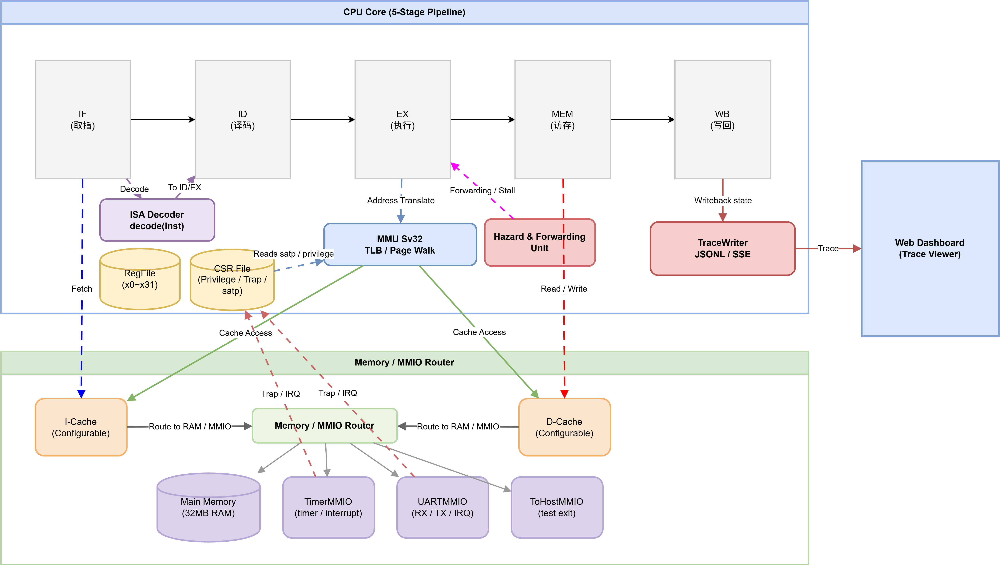
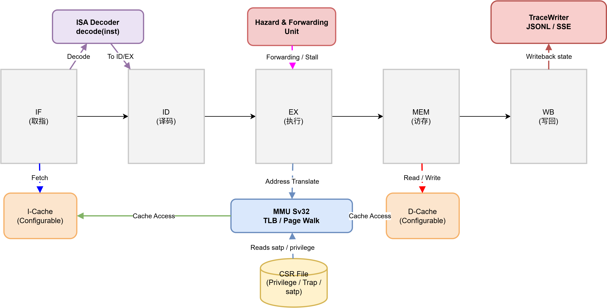
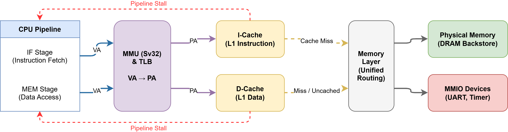
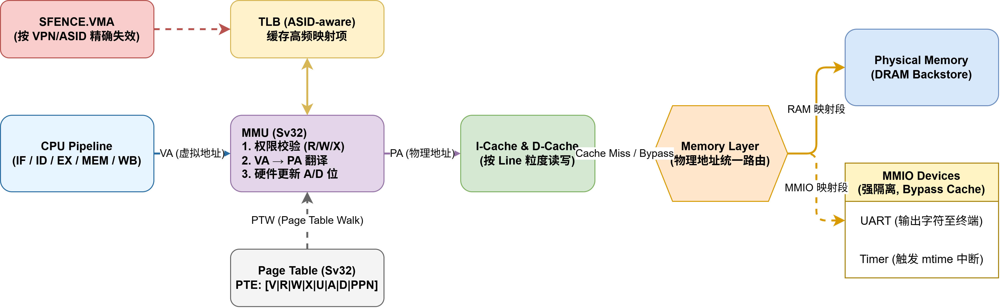
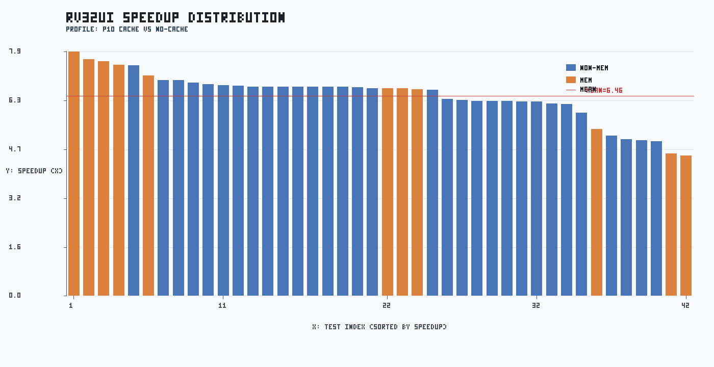
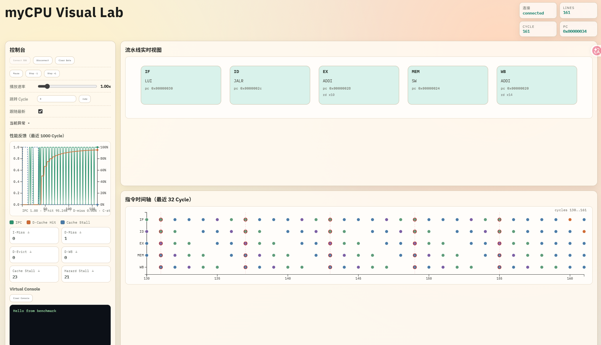
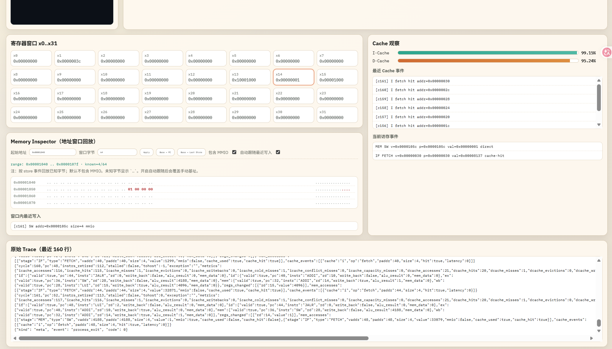

## 高性能 RV32I 流水线模拟器设计与实现--结题报告


### 项目成员
- 袁  善 电计2302 20231072030
- 雷  池 电计2301 20231071319
- 王小方 电计2301 20231071087

**2026年5月6日**


### 1 项目摘要

本项目已完成一台可独立运行的 RV32I 模拟器 myCPU。

技术栈：基于 C++17 + CMake 的 RV32I 五级流水模拟器，配套 Bash 自动化脚本与 Python 数据处理/门禁脚本，使用 RISC‑V 工具链生成 ELF，产出 CSV/JSON/PNG 报表，并通过 SSE/JSONL + HTML/JavaScript（含 D3）提供 Web 可视化与演示。

- 实现：覆盖 49 条有效指令，完成五级流水、I/D Cache、Sv32 基础 MMU、异常与中断、UART/Timer 外设。
- 验证：通过 20 项 CTest 与 42 项 rv32ui 三配置全量测试。
- 性能：cache 在 rv32ui 提供 6.46x 平均加速，在 matmul 与 quicksort 分别达到 11.34x 和 12.71x；benchmark cache matrix 显示 wb_wa 在当前样本下综合最优并已纳入门禁。
- 结论：本阶段主目标（虚拟机 myCPU）已经达成，基本具备最小内核实验条件。

### 2 项目完成情况

- 项目仓库地址：https://github.com/yuuichi33/CA

#### 2.1 对照课程要求项目完成情况

| 课程要求 | 当前状态 | 结论 |
|---|---|---|
| 产出可独立运行的 myCPU 模拟器 | 已完成 | 可执行文件 mycpu 已支持加载 ELF 并运行 |
| 五级流水线 | 已完成 | IF/ID/EX/MEM/WB 全链路实现，含前递与冒险处理 |
| I/D Cache | 已完成 | I-cache 与 D-cache 分离，可配置组相联、写策略、miss penalty |
| 30-40 条基础指令 | 已完成 | 实现 49 条可识别指令（不含 UNKNOWN/SYSTEM 占位） |
| 内存与地址空间模拟 | 已完成（基础） | 物理内存 + MMIO 映射 + 越界检查 + 异常上报 |
| MMU/分页机制（基础版） | 已完成（基础） | Sv32 两级页表 + TLB + SFENCE.VMA |
| 中断与异常模块 | 已完成（课程可用） | ECALL/MRET/SRET、trap delegation、timer/uart interrupt |
| 外设接口（UART、定时器） | 已完成 | UART MMIO、Timer MMIO、TOHOST semihosting 已接入 |
| 统一硬件接口规范 | 已完成（基础） | 统一 Device 接口与 map_device 机制 |
| 完整技术报告 | 已完成 | 已有全量测试与性能报告产物 |
| 可视化 | 已完成 | Web可视化，HTML + D3 的前端实现，用于展示 myCPU trace |
| 在模拟器上运行 miniOS/Linux | 未完成（下阶段可选） | 当前具备最小内核实验条件，但尚无完整 OS 镜像 | 

#### 2.2 交付物

- 可独立运行的 RV32I 指令模拟器 myCPU
- 完整的技术报告与演示

#### 2.3 成员分工

- 袁善：负责项目管理与总体架构设计，CPU/流水线，ISA与译码，CSR与异常中断，存储系统与Cache，基础MMU，外设与ELF装载，Trace与Web可视化，ctest，测试框架与门禁，性能分析与报告撰写，文档写作，ppt制作与汇报。
- 雷池：负责memory模块设计、外设与ELF装载等，协助推进项目其他核心模块的研发与调试，文档写作，ppt制作与汇报。
- 王小方：负责ctest集成与自动化测试、Trace与Web可视化等，协助完成部分开发与系统调试工作，文档写作，ppt制作。

### 3 项目内容

#### 3.1 项目总体架构



- 模块：CPU pipeline（IF→ID→EX→MEM→WB） ⇄ I/D Cache ⇄ MMU(Sv32) ⇄ Memory / MMIO。
- 外设：UART（tohost/semi-hosting）、Timer（mtime 中断）。
- Trace：JSONL/SSE 输出用于 Web 可视化（pipeline 气泡图、指令甘特图、存储器镜像）。

#### 3.2 CPU微结构设计



- 五级顺序流水：IF → ID → EX → MEM → WB；异常与分支通过流水线冲刷与重定向处理。
- 数据冒险：实现寄存器转发（Forwarding），在 load-use 场景插入 1 周期停顿以保证语义正确性。
- 控制冒险与异常：分支冲刷 + trap/中断委托（ECALL/MRET/SRET），CSR 文件用于特权与 trap 管理。
- ISA 覆盖：实现 49 条有效指令（RV32I 子集 + CSR 指令）。

    | 类别 | 条数 | 指令 |
    |---|---:|---|
    | R型算术 | 10 | ADD, SUB, SLL, SLT, SLTU, XOR, SRL, SRA, OR, AND |
    | I型算术 | 9 | ADDI, SLLI, SLTI, SLTIU, XORI, SRLI, SRAI, ORI, ANDI |
    | Load | 5 | LB, LH, LW, LBU, LHU |
    | Store | 3 | SB, SH, SW |
    | Branch | 6 | BEQ, BNE, BLT, BGE, BLTU, BGEU |
    | U型 | 2 | LUI, AUIPC |
    | JAL | 1 | JAL |
    | JALR | 1 | JALR |
    | CSR/特权 | 10 | ECALL, MRET, SRET, SFENCE.VMA, CSRRW, CSRRS, CSRRC, CSRRWI, CSRRSI, CSRRCI |
    | Fence | 2 | FENCE, FENCE.I |
  - 当前有效指令总数为 49（排除占位项 UNKNOWN、SYSTEM）。


- 可观测指标（用于回归与定位）：cycles、instrs、stall、cache_stall、hazard_stall。

#### 3.3 存储系统



- I/D Cache → MMU（Sv32）→ 物理内存 的统一存储链路，Memory 层负责 MMIO 的透明路由与 Bypass。
- MMU 路径：VA → TLB → PA，支持 ASID-aware TLB 与 SFENCE.VMA 的精确失效。
- Cache miss 在流水线中表现为 MEM 阶段等待（计入 cache_stall 指标），会直接增加总周期数。

#### 3.4 I/D Cache架构设计与实现

- Cache组织：按 line 与 set 组织，
    - 默认 16 KB / 64 B line / 4-way（可配置）。
- 替换算法：LRU（最近最少使用）
- 写策略：支持 Write-back / Write-through；
- 写分配策略：Write-allocate / No-write-allocate。
- 性能指标：accesses / hits / misses、evictions / writebacks
    - Miss 可按 Cold/Conflict/Capacity 分类统计以支持结构化分析。
- 实现备注：缺失延迟由 miss_latency 参数模拟（默认 10 cycles），统计数据用于门禁与回归检查。

| 参数名 | 含义 | 默认值与说明 |
| :--- | :--- | :--- |
| `cache_size` | 总容量 | **16 KB** (16384 Bytes) |
| `line_size` | 缓存行大小 | 默认 **64 Bytes** |
| `associativity` | 相联度 | 默认 **4 路**组相联（结构体初始化默认为 1，即 direct-mapped） |
| `miss_latency` | 缺失延迟 | **10**（用于模拟 Cache 未命中时的内存访问周期） |

#### 3.5 MMU 与 MMIO、中断与外设



- MMU 与 MMIO
    - Sv32 两级页表：支持基于 SATP 的标准地址翻译与 PTE（V/R/W/X/U/S/A/D）语义；缺页与权限违规触发 Trap。
    - TLB：ASID-aware 缓存，支持按 VPN/ASID 的精细 SFENCE.VMA 失效以避免地址空间污染。
    - MMIO：Memory 层统一路由；MMIO 映射可强制绕过 Cache（bypass），并具有副作用（如 UART 输出触发终端显示、Timer 触发中断）
- 中断与外设
    - Timer：支持定时器滴答并触发中断（mtime -> CSR mip）。
    - UART：提供串口输入/输出与 semihosting（tohost）支持。
    - 中断处理：优先处理 timer，再处理 UART；触发时通过 CSR 走 trap/委托路径并冲刷流水线。

### 4 测试验证

#### 4.1 测试内容

- ctest：20项，包括指令解码、单周期与五级流水线的执行与冒险/转发处理、缓存子系统、MMU 映射/访问控制与 SFENCE.VMA 语义、CSR 与特权/陷阱委托、ELF 装载、内存的 byte/half/word 操作，以及 UART MMIO、定时器与中断的功能与交互，确保微架构在各种边界条件下的正确性。
- 指令集 (ISA)：42 项 rv32ui 全量测试，验证基础指令的逻辑完备性。
- Benchmarks：
    - hello.c：轻量级功能验证。
    - matmul.c：16x16矩阵乘法（评估高空间局部性访存）。
    - quicksort_stress.c：快排压力测试（评估写策略对频繁交换的影响）。
- Web smoke：trace_server 健康检查与首页可达。

#### 4.2 实验方法与处理 
- 配置对比：对比 p1、p10 与 no-cache 三组环境。采集相关数据并计算相关系数与分解。
    - 三组配置含义

        | 配置名 | cache 状态 | miss penalty | 含义 |
        |---|---|---|---|
        | p1 | 开启 | 1 | 低 miss 代价组，用于观察理想 cache 效果 |
        | p10 | 开启 | 10 | 高 miss 代价组，用于观察 miss 对性能放大效应 |
        | no-cache | 关闭 | 10 | 无 cache 基线；访存直接走内存路径 |
    - 相关参数
        - `speedup_p10 = cycles_nocache / cycles_p10`。值越大表示 cache 收益越高。
        - `speedup_p1 = cycles_nocache / cycles_p1`。用于评估低 penalty 下收益上限。
        - `penalty_ratio = cycles_p10 / cycles_p1`。用于评估 workload 对 miss penalty 敏感度。
        - 相关系数 `corr(D-hit, speedup)` 与 `corr(I-hit, speedup)` 用于衡量命中率与收益关系。

- 策略矩阵：对比 5 种Cache策略组合（wb_wa / wb_nowa / wt_wa / wt_nowa / nocache）。

    - wb_wa (Write-Back + Write-Allocate)：写回策略 + 写分配。这是现代高性能处理器的标配。当发生写缺失（Write Miss）时，硬件会将数据块从主存加载到 Cache 中再进行修改。
    - wb_nowa (Write-Back + No-Write-Allocate)：写回策略 + 不写分配。写缺失时直接写入主存，不将数据块调入 Cache。
    - wt_wa (Write-Through + Write-Allocate)：写直达策略 + 写分配。每次写入都会同步更新到主存。
    - wt_nowa (Write-Through + No-Write-Allocate)：写直达策略 + 不写分配。
    - nocache：禁用 Cache。所有访存指令直接穿透至物理内存，每次访问固定承受 10 个周期的 Miss Penalty（延迟惩罚）。
- 自动化链路：
    - test_all.sh 自动化测试，并将数据导出至 CSV。
    - gen_full_test_report.py 对齐数据并计算相关系数与 Speedup，生成性能报告。
    - check_benchmark_cache_gate.py 等自动化性能门禁判定。

#### 4.3 正确性结果

- ctest: 20/20 通过，失败 0。
- rv32ui p1: 42/42 通过。
- rv32ui p10: 42/42 通过。
- rv32ui no-cache: 42/42 通过。
- benchmark 返回码：
    | benchmark | rc_p1 | rc_p10 | rc_nocache |
    |---|---:|---:|---:|
    | hello | 0 | 0 | 0 |
    | matmul | 0 | 0 | 0 |
    | quicksort_stress | 0 | 0 | 0 |
- gate status: PASS (baseline: `wb_wa`)
- gate issues: 0
- web smoke
    - 采样状态：PASS
    - 状态说明：sampled
    - 健康检查响应：
{"ok": true, "clients": 0, "buffered_lines": 0, "total_lines": 0, "last_cycle": -1, "child_pid": null, "child_running": false, "ts": 1776134762}

- **结论：全部通过正确性验证。**

### 5 性能结果与分析

- **[完整性能报告](../FULL_TEST_PERFORMANCE_REPORT.md)`../FULL_TEST_PERFORMANCE_REPORT.md`**

#### 5.1 ISA

- Speedup：平均加速 6.46x，最高可达7.88x
- 延迟掩盖：p10/p1 平均 cycle 比：1.54×，表明在平均场景下 cache 对高内存延迟有明显掩盖作用。
- 访存密集型用例加速比 (6.57x) 显著高于非访存型 (6.41x)。符合预期。

- 平均 stall 拆分（算术平均）：stall / cache_stall / hazard_stall = 5.19 / 315.14 / 5.19 
    - 前递（Forwarding）显著降低了寄存器相关停顿，但 load-use 情形仍会产生短暂停顿以保证正确性。
- Miss分解：I-miss 以 Cold Miss 为主（约 87%）；D-miss 以 Conflict Miss 为主（约 85%），与 rv32ui 官方测试（许多短小、独立的微测试）的固有特性相关。
- 策略选优：wb_wa (写回+写分配) 凭借对局部性的精准捕捉，在 D-Hit 普遍偏低 (18-19%) 的环境下，依然获得了最低的执行周期 (696.88)

    | policy | pass/tests | avg_cycles | avg_i_hit | avg_d_hit | speedup_vs_nocache |
    |---|---:|---:|---:|---:|---:|
    | wb_wa | 42/42 | 696.88 | 93.50 | 19.41 | 6.4705 |
    | wb_nowa | 42/42 | 698.88 | 93.50 | 18.34 | 6.4553 |
    | wt_wa | 42/42 | 698.88 | 93.50 | 18.34 | 6.4553 |
    | wt_nowa | 42/42 | 698.88 | 93.50 | 18.34 | 6.4553 |
    | nocache | 42/42 | 4633.83 | 0.00 | 0.00 | 1.0000 |

    - 所有 5 种模式均以 42/42 的成绩通过了 RISC-V 官方指令集测试，证明了 Cache 控制器状态机在处理任意边缘指令时不存在数据一致性（Consistency）漏洞。
    - 由于官方测试程序极短，数据访问量极小，D-Cache 的平均命中率普遍较低（约 18%-19%）。这反映了典型的冷启动缺失（Cold Miss）主导场景。即便如此，wb_wa 策略依然凭借其对局部性的微弱捕捉，取得了最低的平均周期数（696.88）。

#### 5.2 Benchmarks

- penalty_ratio接近 1.00 表明cache的延迟掩盖效果优秀
- matmul (11.34x 加速)：矩阵乘法具有极强的空间局部性，D-Cache 命中率高达 99.50%。Cache 将 315 万周期的运行时间压缩到了 27 万。
- quicksort_stress (12.71x 加速)：快排涉及深度的递归栈操作和频繁的非连续数组交换，导致极高的数据读写压力。在没有 Cache 时周期数高达 2500 万，开启后通过 Write-Back 策略合并了大量对同一栈地址的重复写入，获得了12.7 倍加速。

| benchmark | cycles_p1 | cycles_p10 | cycles_nocache | speedup_p10 | speedup_p1 |
|---|---:|---:|---:|---:|---:|
| hello | 143 | 161 | 1518 | 9.43x | 10.62x |
| matmul | 277570 | 277966 | 3151861 | 11.34x | 11.36x |
| quicksort_stress | 1971272 | 1972901 | 25074548 | 12.71x | 12.72x |

| benchmark | penalty_ratio | i_hit_p10 | d_hit_p10 | stall_p10 | checksum_p10 |
|---|---:|---:|---:|---:|---|
| hello | 1.13x | 99.15% | 95.24% | 21 | - |
| matmul | 1.00x | 99.98% | 99.50% | 165 | - |
| quicksort_stress | 1.00x | 100.00% | 99.86% | 56 | e48d8e25 |

- benchmark 平均 speedup_p10: 11.16x；中位数: 11.34x。
- benchmark 平均 penalty_ratio_p10_over_p1: 1.04x。
- matmul（no-cache / p10）cycle 比: 11.34x
- quicksort_stress（no-cache / p10）cycle 比: 12.71x

| policy | pass/benchmarks | avg_cycles | avg_i_hit_pct | avg_d_hit_pct | avg_speedup |
|---|---:|---:|---:|---:|---:|
| wb_wa | 3/3 | 750342.67 | 99.71 | 98.20 | 11.1590 |
| wb_nowa | 3/3 | 751638.67 | 99.71 | 93.95 | 11.1440 |
| wt_wa | 3/3 | 751638.67 | 99.71 | 93.95 | 11.1440 |
| wt_nowa | 3/3 | 751638.67 | 99.71 | 93.95 | 11.1440 |
| nocache | 3/3 | 9409309.00 | 0.00 | 0.00 | 1.0000 |

- 对比 nocache 模式下的 940 万个平均周期，开启 Cache 后周期数骤降至 75 万左右，实现了高达 11.15 倍 的综合加速比。
- 在当前 benchmark 样本中，wb_wa 策略的 D-Cache 命中率为 98.20%，高于其他策略的 93.95%。
  - 原理解析：快排和矩阵乘法中存在较多“读-修改-写”访问模式，write-allocate 更容易把首次写缺失后的数据块提前带入 Cache，从而提高后续复用命中的机会。这里描述的是当前样本下观察到的相关现象，而不是对所有 workload 的普遍结论。

#### 5.3 结论

cache性能良好， 在 rv32ui 提供 6.46x 平均加速，在 matmul 与 quicksort 分别达到 11.34x 和 12.71x；benchmark cache matrix 显示 wb_wa 在当前样本下综合最优并已纳入门禁。

### 6 可视化与工程化

#### 6.1 可视化
- 数据链路：SSE/JSONL Trace → Web dashboard（支持确定性单步、回放与周期跳转）。
- 多维视图：Pipeline (气泡/转发可视化)、指令甘特图 (冒险/时序分析)、存储器 (Cache命中/内存镜像)。
- 量化监控：窗口化 KPI 统计（IPC / 命中率 / Stall 占比）及历史趋势曲线，辅助识别性能瓶颈。




- 面板展示内容
    - 流水线实时视图（IF/ID/EX/MEM/WB）
    - 最近 32 cycle 指令时间轴
    - 侧边栏性能折线图（最近 1000 cycle 的 IPC、D-Cache 命中率、Cache Stall 占比）
    - 性能 KPI 卡片（窗口内 I/D miss、D eviction/writeback、cache/hazard stall 增量）
    - x0..x31 寄存器窗口（高亮当周期写回）
    - I/D cache 命中率与事件列表
    - 当前周期访存事件与原始 trace
    - Memory Inspector（按地址窗口回放，随 cycle 更新）
    - Virtual Console（从 Trace 的 UART 写入事件提取字符）
- 运行
    先启动 trace server：

    ```bash
    cd /home/ys/camycpu
    ./tools/run_trace_demo.sh

    # 可选：指定 ELF 与最大周期数
    ./tools/run_trace_demo.sh benchmarks/hello.elf 200

    # 可选：固定端口，避免自动回退
    TRACE_PORT=8080 ./tools/run_trace_demo.sh benchmarks/hello.elf 200
    ```

    脚本会打印最终访问地址；如果 8080 被占用会自动回退到其他端口（例如 18080/18081）。

    然后浏览器访问脚本打印的 URL，例如：

    ```text
    http://localhost:8080
    ```


#### 6.2 自动化
- 一键测试链路：test_all.sh 驱动 CTest、rv32ui 以及多配置 Benchmark 运行。
- 报告自动生成：脚本采集数据并生成 CSV、JSON 门禁判定及 Markdown 技术报告。
- 性能门禁：check_benchmark_gate. py 等自动对比基准值，拦截性能退化。
    - 以 wb_wa 为 Baseline 策略；基于预设阈值判定，失败则阻断产出或触发 Warn 预警。

### 7 总结及未来计划

#### 7.1 总结
- 已完成：一台可独立运行的 RV32I 指令模拟器 myCPU（五级顺序流水、I/D Cache、Sv32 MMU、UART/Timer、49 条有效指令），**达到课程项目要求**。
- 验证与门禁：CTest 20/20、rv32ui p1/p10/no-cache 均 42/42 ；benchmark返回值均为0，即PASS ；cache/benchmark gate  PASS。**正确性验证通过**。
- 性能：**cache性能良好**， 在 rv32ui 提供 6.46x 平均加速，在 matmul 与 quicksort 分别达到 11.34x 和 12.71x；benchmark cache matrix 显示 wb_wa 在当前样本下综合最优并已纳入门禁。

#### 7.2 未来计划

- 在模拟器上运行 miniOS（或最小 Linux 镜像）
- 增强中断/MMU 边界测试
- 扩展 trace 可视化功能与长期负载评估
- 针对cache优化进行调研，进一步优化cache
- ……


**【时间】2026年5月6日**
